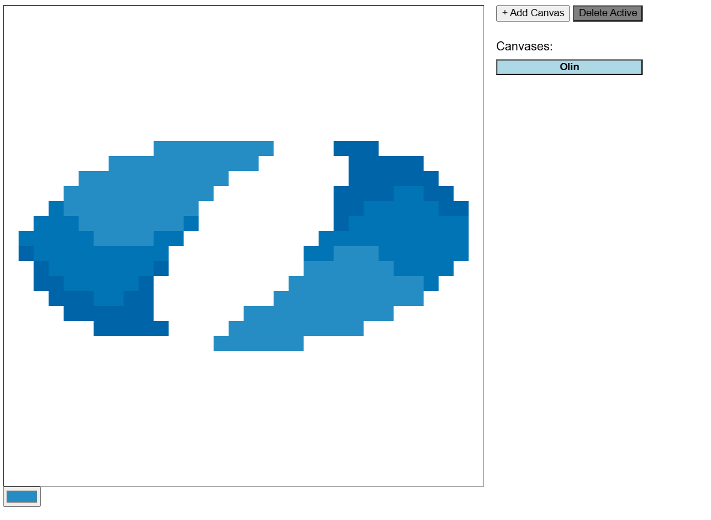

# Pixel Canvas

Inspired by r/place, made for Intro to Databases final project. r/place is a
public canvas where people can each color pixels to collaboratively create piece
of artwork. I made a simplified version of it using Flask and SQLite, with the
additional feature of being able to create different canvases. The project can
be run locally but is also hosted on Render
[here](https://pixel-canvas-zaqp.onrender.com/).



## Local Setup

1. Clone the repo
2. Run `pip install -r requirements.txt`
3. From the root directory, run `python app.py`
4. Go to http://127.0.0.1:5000/ in your browser

## Repo Overview

```
pixel-canvas/
├── img/
├── static/
│   ├── canvas.js/
├── templates/
│   ├── index.html/
├── app.py
├── pixel.db
```

-   `img/`: Images used in the README
-   `canvas.js`: Frontend logic handling input, pixel coloring, and canvas
    buttons.
-   `index.html`: Main HTML file for the app, contains the canvas and buttons.
-   `app.py`: Main Flask app, containing endpoints for interacting with the
    SQLite database.
-   `pixel.db`: SQLite database file, contains the tables for canvases and
    pixels.

## Main Challenges

The main challenge was justing figuring out what I'm doing and how to scaffold
the project, as I have very limited experience with web dev and JavaScript. Once
I got started I got the hang of it fairly quickly, and the video game UI
development that I've done was fairly transferable to web dev.

Figuring out where to host the project was also a bit of a challenge. I poked
around with Google Cloud for a bit, but eventually found Render which was very
straightforward to set up. It allowed me to keep using SQLite instead of
switching to Cloud SQL. However because the database isn't hosted separately it
does mean that the database resets each time the app is redeployed, which is not
ideal for a database.
